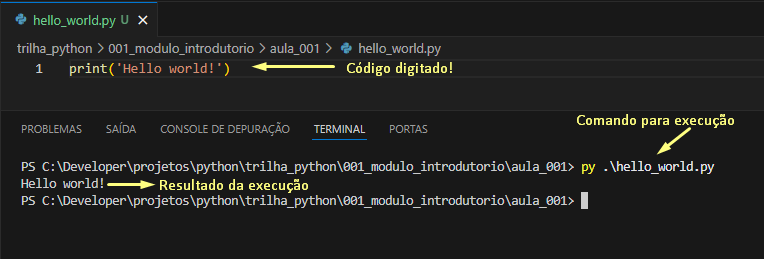

# INICIANDO COM PYTHON
<p>Nesta aula vamos aprender a criar um código simples e executável no Python. Embora ele não funcional ele é super educativo e compensador.</p>
<p>Este é o primeiro código de qualquer programador! Um programa que exibe uma mensagem simples no console.</p>

## Passos a serem seguidos
1. Abra o VSCode;
2. Crie um novo arquivo no seu projeto;
3. Digite o código abaixo:
```python
print('Hello World!')
```
4. Salve o arquivo com o nome: hello_world.py;
5. Abra o terminal no VSCode;
6. Navegue até a pasta da aula;
7. E execute o seguinte comando:
```terminal
py .\hello_world.py
```

## Resultado da execução
